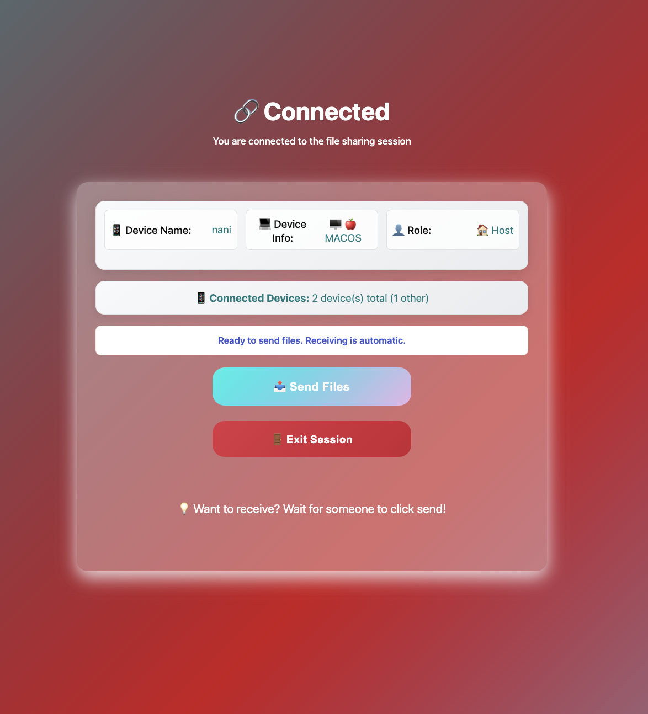
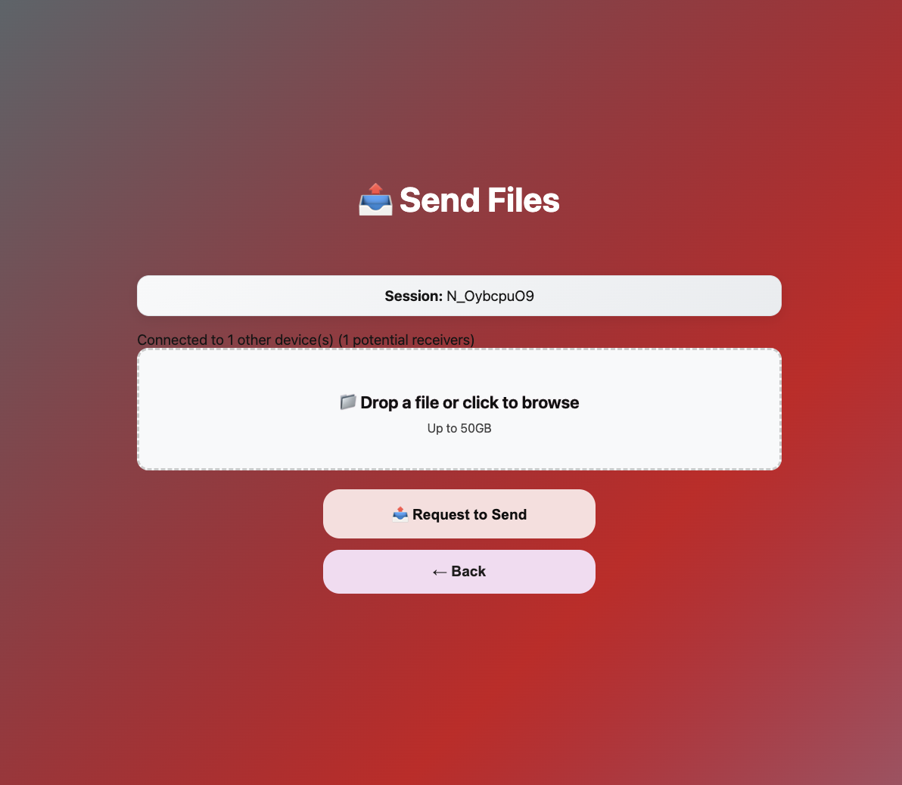
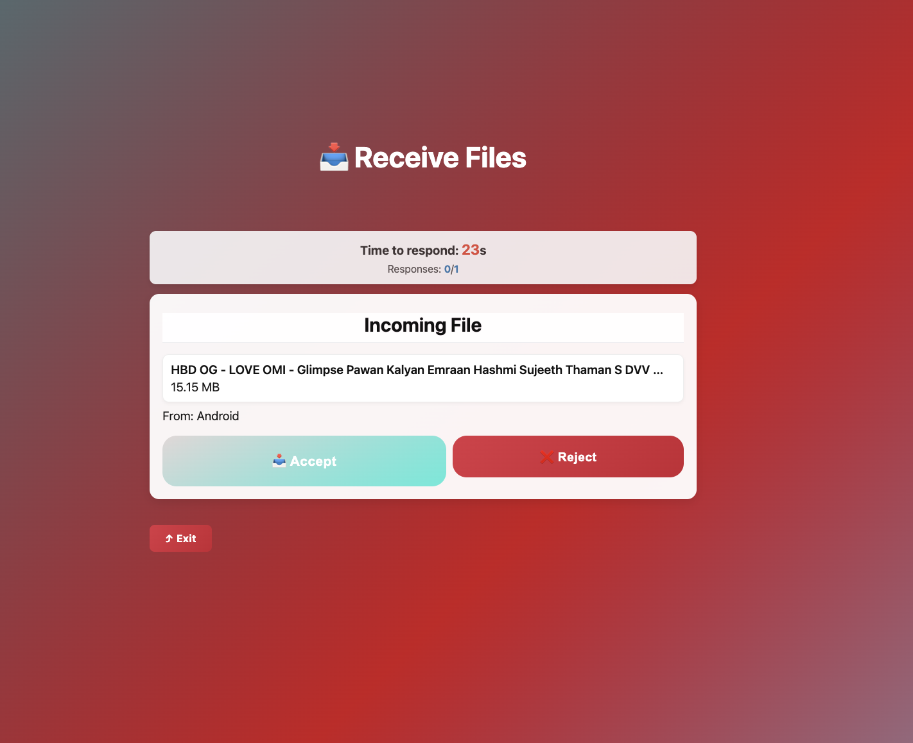

# JAVIN FileShare

A cross-platform file sharing web application that makes file sharing across devices easier without using any internet. This works for multi-device file sharing across any two devices which are joined to the same network or one created hotspot, others joined. You can share files with Windows, Mac, iPhone, Linux simultaneously and fastly.

## ✨ Features
- 🚀 **Cross-platform support** - Windows, Mac, iPhone, Linux,Android
- 🌐 **No internet required** - Works on local network only
- 📱 **Multi-device support** - Share files simultaneously across devices
- 🔗 **Hotspot support** - Works with mobile hotspot connections
- ⚡ **Fast transfers** - Direct device-to-device connections via host server.
- 🔒 **Secure HTTPS** - Self-signed certificates for local network
- 📊 **Real-time progress** - Live transfer progress updates
- 🎯 **Simple PIN/QR workflow** - Easy device connection

## 📁 Project Structure
- `backend/` – Node.js/Express server with WebRTC P2P file transfers
- `frontend/` – HTML/CSS/JavaScript web interface
- `setup.bat` – Windows double-click launcher
- `start.sh` – Unix/Linux/macOS launcher script
- `FileShare.command` – macOS double-click launcher
- `FileShare.desktop` – Linux desktop entry
- `setup.sh` – Original setup script for advanced users

## 🔧 Prerequisites

### Required Software
1. **Node.js 18+** - [Download from nodejs.org](https://nodejs.org/)
2. **Git** (for OpenSSL on Windows) - [Download from git-scm.com](https://git-scm.com/)

### Installation Steps
1. **Install Node.js:**
   - Go to [nodejs.org](https://nodejs.org/)
   - Download and install the LTS version
   - Verify installation: `node --version` (should show v18+)

2. **Install Git (Windows only):**
   - Go to [git-scm.com](https://git-scm.com/)
   - Download and install Git for Windows
   - This provides OpenSSL for certificate generation

3. **Download FileShare:**
   - Clone this repository or download as ZIP
   - Extract to your desired location

## 🚀 Quick Start (One-Click Launch)

### Windows
1. **Double-click `setup.bat`**
2. **Grant admin privileges** when prompted (for certificate installation)
3. **Wait for browser to open** automatically
4. **Start sharing files!**
5. if not worked with above then follow manual setup  # Install dependencies go to folder (after extracing) in that open terminal and type
6.      #installing dependencies
            cd backend
            npm install
            
            # Start the server
            node server.js


### macOS
1. **Double-click `FileShare.command`**
2. **Grant Terminal permissions** if prompted
3. **Wait for browser to open** automatically
4. **Start sharing files!**

### Linux
1. **Double-click `FileShare.desktop`** (if supported)
2. **Or double-click `start.sh`** (if Terminal is set as default)
3. **Wait for browser to open** automatically
4. **Start sharing files!**

## 🔧 What the Launchers Do
- ✅ **Detect your device IP** automatically
- ✅ **Install dependencies** (npm install)
- ✅ **Generate SSL certificates** (if missing)
- ✅ **Trust certificates** in your OS
- ✅ **Start the server** on your network
- ✅ **Open browser** automatically
- ✅ **Show server status** in the terminal

## 📱 Supported Platforms
- ✅ **Windows** (7, 8, 10, 11)
- ✅ **macOS** (10.14+)
- ✅ **Linux** (Ubuntu, Debian, Fedora, etc.)
- ✅ **iPhone/iPad** (Safari browser)
- ✅ **Android** (Chrome browser)

## 📖 How to Use FileShare

### Step 1: Start the Host
1. **Run the launcher** on your main device
2. **Wait for browser to open** automatically
3. **Note the PIN** displayed on screen
4. **Share the QR code** or PIN with other devices

### Step 2: Connect Other Devices
1. **Open the same URL** on other devices (shown in browser)
2. **Enter the PIN** or scan the QR code
3. **Wait for connection** confirmation

### Step 3: Share Files
1. **Click "Send Files"** on the host device
2. **Select files** to share (drag & drop supported)
3. **Click "Request to Send"**
4. **Other devices** will see accept/reject prompt
5. **Transfer begins** automatically after acceptance

### Step 4: Receive Files
1. **Click "Accept"** on receiving device
2. **Watch progress** in real-time
3. **Files saved** automatically to downloads

## 🖼️ Screenshots

### Connected Dashboard

*Host dashboard showing device info and PIN for connection*

### Send Files

*Drag & drop interface for selecting files to share*

### Receive Files

*Accept/reject prompt with real-time transfer progress*

### PIN/QR Connection

*QR code and PIN for easy device connection*

## HTTPS and Certificates
- Certs are NOT stored in Git. They are generated locally by the setup scripts
- macOS: trusted via System keychain; Linux: added via `update-ca-certificates`/`update-ca-trust`/`trust`; Windows: added with `certutil`
- If your browser shows a warning on first run, ensure the cert was trusted (rerun the setup script) or manually trust it

## 🔧 Troubleshooting

### Common Issues

#### Browser Security Warning
- **Problem**: Browser shows "Not Secure" or certificate warning
- **Solution**: Trust the certificate by running the launcher as administrator (Windows) or with sudo (macOS/Linux)

#### Port Already in Use
- **Problem**: Error "Port 4000 is already in use"
- **Solution**: 
  1. Close other applications using port 4000
  2. Or change port in `backend/server.js` (line 30)
  3. Restart the launcher

#### Firewall Issues
- **Problem**: Other devices can't connect
- **Solution**: 
  1. Allow Node.js through Windows Firewall
  2. Allow port 4000 in your router settings
  3. Check if antivirus is blocking the connection

#### Slow Transfer Speed
- **Problem**: File transfers are slow
- **Solution**:
  1. Use 5GHz Wi-Fi instead of 2.4GHz
  2. Connect via Ethernet cable
  3. Close other bandwidth-heavy applications

#### Certificate Issues
- **Problem**: "Certificate not trusted" error
- **Solution**:
  1. **Windows**: Run `setup.bat` as administrator
  2. **macOS**: Run `FileShare.command` and enter password when prompted
  3. **Linux**: Run `start.sh` with sudo

### Manual Setup (Advanced Users)

If the launchers don't work, you can run manually:

```bash
# Install dependencies
cd backend
npm install

# Start the server
node server.js

# Open browser to https://your-ip:4000
```

## 🛠️ Development

### Prerequisites for Development
- Node.js 18+
- Git (for version control)
- Code editor (VS Code recommended)

### Running in Development Mode
```bash
# Clone the repository
git clone https://github.com/venkatbayanaboina/Javin-Share-.git
cd Javin-Share-

# Install dependencies
cd backend
npm install

# Start development server
node server.js
```

### Project Structure
```
FileShare_Project_8_clean/
├── backend/                 # Node.js server
│   ├── server.js           # Main server file
│   ├── package.json        # Dependencies
│   └── certs/              # SSL certificates (auto-generated)
├── frontend/               # Web interface
│   ├── index.html          # Main page
│   ├── send.html           # Send files page
│   ├── receive.html        # Receive files page
│   ├── script.js           # Frontend JavaScript
│   └── style.css           # Styling
├── setup.bat              # Windows launcher
├── start.sh               # Unix/Linux launcher
├── FileShare.command      # macOS launcher
└── README.md              # This file
```

## 💻 System Requirements

### Minimum Requirements
- **RAM**: 512MB available memory
- **Storage**: 100MB free space
- **Network**: Local network connection (Wi-Fi or Ethernet)
- **Browser**: Modern browser with WebRTC support

### Recommended Requirements
- **RAM**: 2GB+ available memory
- **Storage**: 500MB+ free space
- **Network**: 5GHz Wi-Fi or Ethernet connection
- **Browser**: Latest Chrome, Firefox, Safari, or Edge

### Supported Browsers
- ✅ **Chrome** 60+
- ✅ **Firefox** 55+
- ✅ **Safari** 11+
- ✅ **Edge** 79+

## 🔒 Security Notes
- **Local network only** - This is intended for local network use
- **Self-signed certificates** - Provide transport encryption for local network
- **No data collection** - All file transfers happen directly between devices
- **No internet required** - Works completely offline on your local network
- **Secure P2P transfers** - Files are transferred directly between devices using host server .

## 📊 Performance
- **Transfer speed**: Limited by your local network speed
- **Concurrent transfers**: Multiple files can be transferred simultaneously
- **Real-time progress**: Live progress updates for all transfers

## 🤝 Contributing
1. Fork the repository
2. Create a feature branch (`git checkout -b feature/amazing-feature`)
3. Commit your changes (`git commit -m 'Add amazing feature'`)
4. Push to the branch (`git push origin feature/amazing-feature`)
5. Open a Pull Request

## 📄 License
This project is licensed under the MIT License - see the [LICENSE](LICENSE) file for details.

## 🙏 Acknowledgments
- Built with Node.js and Express
- Uses busboy
- QR code generation with qrcode library
- Cross-platform compatibility with native launchers

---

**Made with ❤️ for easy file sharing across all your devices!**
